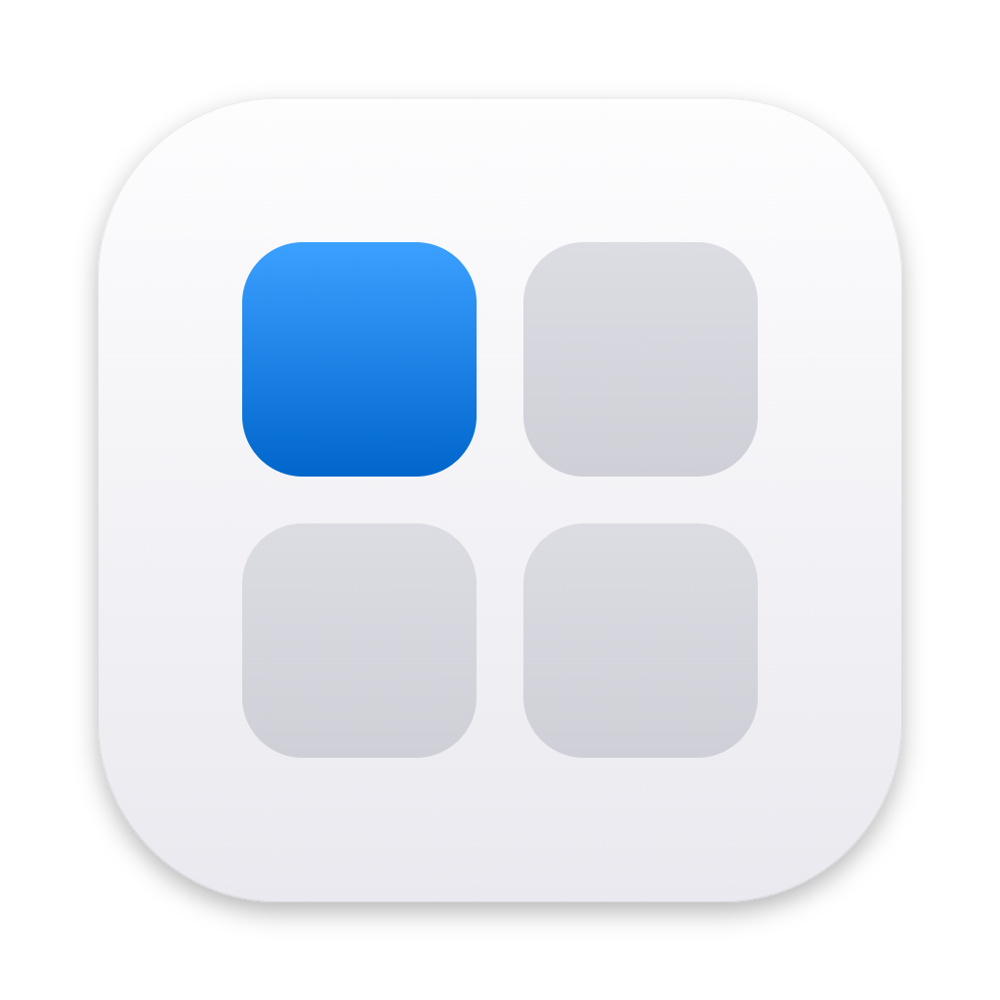
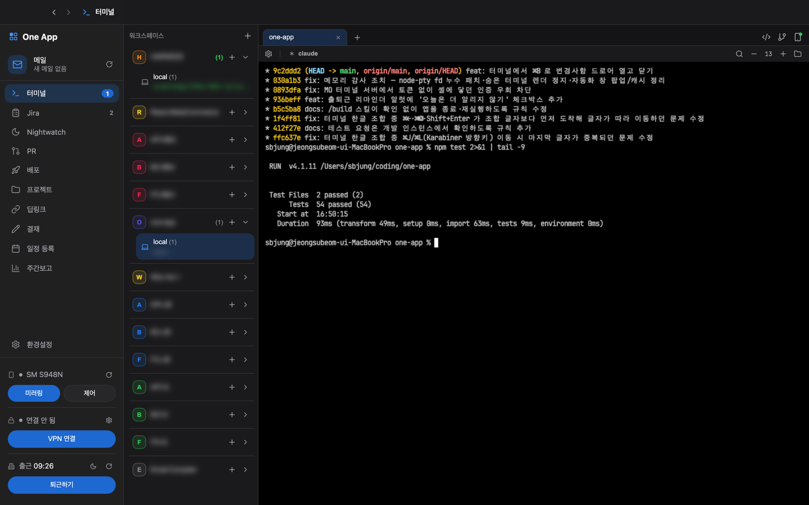
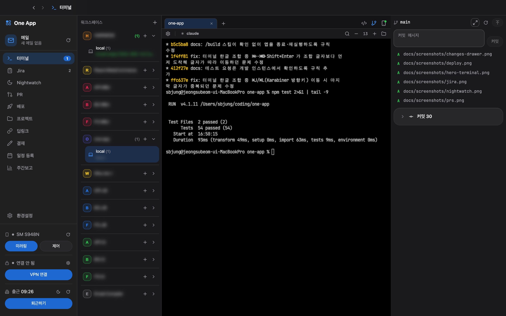
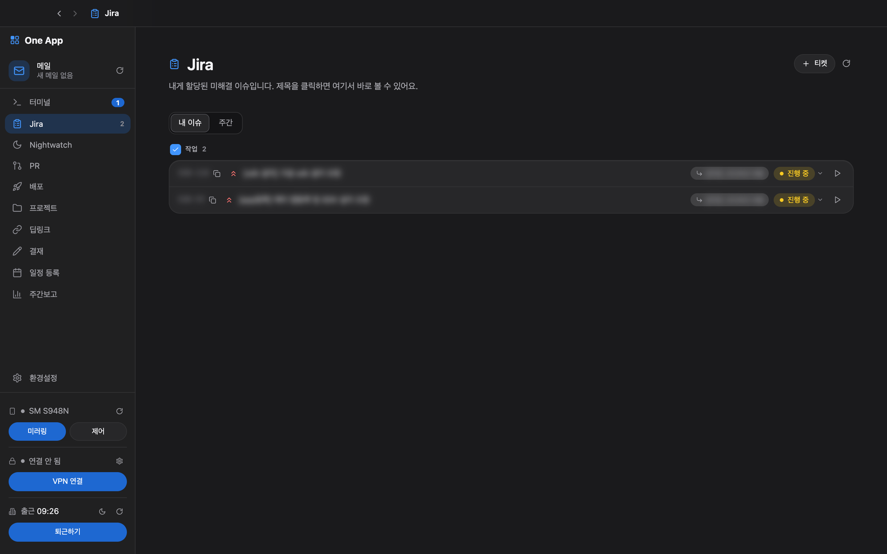
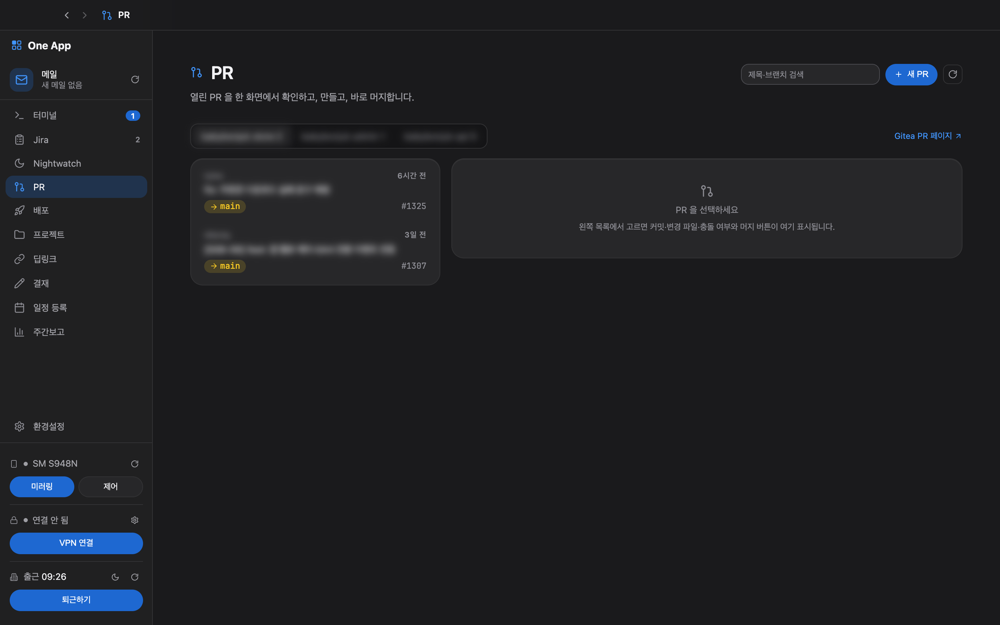
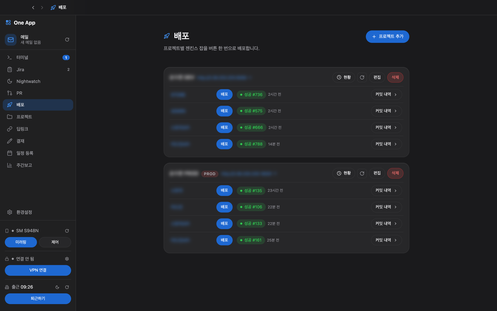
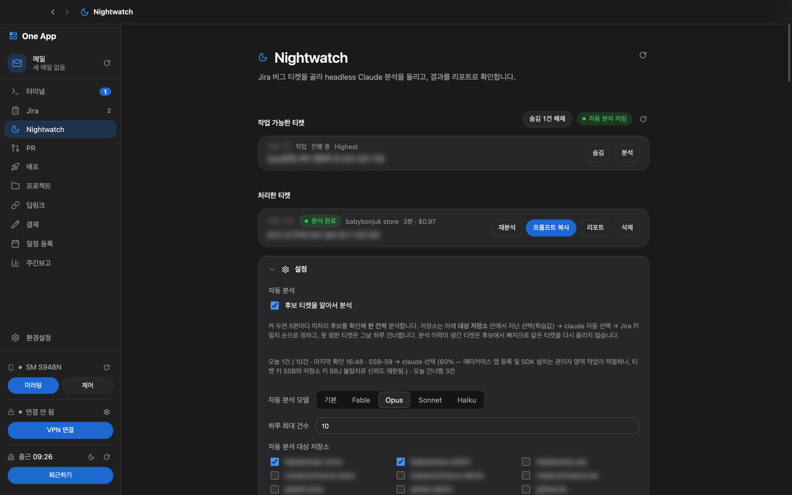

<p align="center">
  
</p>

<h1 align="center">One App</h1>

<p align="center">
  하나의 창에서 사내 도구를 관리하는 <b>macOS 워크스페이스 허브</b><br>
  터미널 · Jira · PR · 배포 · 결재 · 근태 · 메일 · VPN 을 사이드바 하나로.
</p>

<p align="center">
  
  
  
  
  
  
</p>

<p align="center">
  
</p>

> 🇰🇷 사용자·코드·문서 모두 **한국어**로 작성합니다. 회사 내부 시스템(그룹웨어·Jira·Gitea·젠킨스)과 연동되는 개인 도구이며, 계정 정보는 저장소가 아니라 macOS 키체인(`safeStorage`)에만 보관합니다.

---

## ✨ 무엇을 하나요

매일 열어 두는 창은 **터미널** 하나로 두고, 그 옆에 하루 동안 오가는 사내 도구를 붙였습니다. 브라우저 탭을 열고 로그인하고 찾아가는 왕복을 없애는 것이 목표입니다.

| 영역 | 기능 |
|---|---|
| 🖥️ **터미널** | tmux 백엔드 + xterm.js. 워크스페이스·워크트리별 세션, 분할, 프리셋(claude 등 에이전트 원클릭), 앱을 다시 켜도 세션 유지 |
| 📱 **MO 터미널** | 같은 세션을 **폰 브라우저**에서 이어서 사용 (Tailscale 전용 바인딩 + 토큰 인증) |
| 🔀 **변경사항** | 터미널 옆 드로어(⌘B)로 git 상태·diff·커밋·푸시. 사이드-바이-사이드 diff 오버레이 |
| 📋 **Jira** | 내게 할당된 이슈 목록·상태 전환·티켓 생성, 사이드바 뱃지, 주간 활동 뷰 |
| 🌙 **Nightwatch** | Jira 버그 티켓을 골라 headless Claude 로 무인 분석 → 리포트 (수동 + 5분 주기 자동) |
| 🔃 **PR** | Gitea PR 목록·생성·머지, 충돌·리뷰 상태, 머지 시 Jira 해결 제안 |
| 🚀 **배포** | 젠킨스 잡 원클릭 트리거, 커밋 미리보기, 상태 폴링, PROD 보호 확인 |
| 🗂️ **프로젝트** | 배포·PR·터미널이 공유하는 프로젝트 중앙 레지스트리 |
| 🔗 **딥링크** | applink 생성 |
| ✍️ **결재** | 야근·휴가·지출결의서 — 그룹웨어 결재 자동 작성 |
| 📅 **일정 등록 · 📊 주간보고** | 그룹웨어 일정 입력, FE 챕터 주간 수집 → T/OT·MM 차트 |
| 📨 **메일 · 🔒 VPN · 📱 폰 미러링 · 🕘 출퇴근** | 사이드바 위젯 — 안읽은 메일, OpenVPN+TOTP, scrcpy, 근태 찍기·리마인더 |

---

## 📸 스크린샷

> 사내 정보(티켓 제목·저장소명·URL 등)는 블러 처리했습니다. 다크 테마 기준이며 라이트/시스템 테마도 지원합니다.

<table>
  <tr>
    <td align="center"><b>변경사항 드로어</b> — 터미널 옆에서 바로 diff·커밋</td>
    <td align="center"><b>Jira</b> — 내 이슈와 상태 전환</td>
  </tr>
  <tr>
    <td></td>
    <td></td>
  </tr>
  <tr>
    <td align="center"><b>PR</b> — Gitea PR 확인·생성·머지</td>
    <td align="center"><b>배포</b> — 젠킨스 잡 원클릭, PROD 보호</td>
  </tr>
  <tr>
    <td></td>
    <td></td>
  </tr>
  <tr>
    <td colspan="2" align="center"><b>Nightwatch</b> — Jira 티켓 무인 분석 미션</td>
  </tr>
  <tr>
    <td colspan="2"></td>
  </tr>
</table>

---

## 🚀 시작하기

### 요구사항

| 구분 | 내용 |
|---|---|
| OS | macOS (Electron 43) |
| 런타임 | Node.js 22 |
| 터미널 백엔드 | `brew install tmux` |
| 선택 | `scrcpy`(폰 미러링) · `openvpn`(VPN) · `claude` CLI(Nightwatch·프리셋) · Tailscale(MO 접속) |

### 실행

```bash
npm install          # postinstall 이 node-pty 권한·fd 누수 패치를 함께 처리합니다
npm start            # 개발 모드 (렌더러 HMR)
```

> ⚠️ 개발 인스턴스는 설치된 앱과 **설정(userData)을 공유**하고 포트·tmux 소켓·창 상태만 분리합니다. 둘을 동시에 띄워 두는 것이 기본 사용 방식입니다.

### 빌드

```bash
npm run package      # .app
npm run make         # .app + 배포용 .zip  (macOS 는 ZIP maker 만 있습니다)
```

### 품질 검사

```bash
npx tsc --noEmit     # 타입 검사
npm run lint         # ESLint (exhaustive-deps 경고 0 유지)
npm test             # vitest — 순수 로직 단위 테스트
```

---

## 🧱 구조

Electron 의 세 컨텍스트를 엄격히 나누고, 렌더러↔메인 통신은 `preload` 가 노출한 `window.oneApp` 하나로만 합니다. 기능은 **feature 폴더 단위**(Bulletproof React 스타일)로 묶고, 기능 간 참조는 각 폴더의 `index.ts` 공개 API 로만 허용합니다.

```
src/
├── main/                  # 🖥️ 메인 프로세스 (Node)
│   ├── main.ts            #   창 생성 + register*Ipc()
│   ├── features/<기능>/   #   ipc.ts + 로직 + store.ts
│   └── lib/               #   http · store · broadcast · groupware · moIpc …
├── preload/preload.ts     # 🌉 contextBridge → window.oneApp
├── renderer/              # 🎨 React UI
│   ├── app/App.tsx        #   앱 셸(사이드바/탑바/메인) + SECTIONS
│   ├── components/        #   공용 UI (Button · Modal · DatePicker …)
│   ├── features/<기능>/   #   components/ + lib/ + index.ts
│   └── styles/            #   SCSS — _base.scss 디자인 토큰
├── mobile/                # 📱 MO 터미널 페이지
├── mobile-app/            # 📱 MO 앱 셸 (렌더러 재사용)
└── shared/                # 🔗 공용 타입·프로토콜
```

| 항목 | 선택 |
|---|---|
| 프레임워크 | Electron 43 · React 19 · TypeScript 5 |
| 빌드 | Electron Forge + Vite 7 |
| 터미널 | node-pty + tmux · @xterm/xterm 6 (WebGL) |
| 스타일 | SCSS(`sass-embedded`) — 토큰 기반, 라이트/다크 |
| 테스트 | vitest |
| 자동화 | 숨은 `BrowserWindow` 로 그룹웨어 작업 (외부 브라우저 의존 없음) |

---

## 🎨 디자인

Apple 계열 룩앤필 — 파치먼트 캔버스, 흰 카드, **액션 블루 단일 액센트**, SF Pro, 무그림자 크롬, 필 버튼. 색·크기·모션은 전부 `src/renderer/styles/_base.scss` 토큰에서 나오며 기준 문서는 [`DESIGN.md`](DESIGN.md) 입니다. 테마는 시스템/라이트/다크를 지원합니다.

---

## 📚 문서

| 문서 | 내용 |
|---|---|
| [`CLAUDE.md`](CLAUDE.md) | 작업 가이드 — 구조·컨벤션·반드시 지킬 것 |
| [`DESIGN.md`](DESIGN.md) | 디자인 시스템 (토큰 정본은 `_base.scss`) |
| [`ROADMAP.md`](ROADMAP.md) | 구현 완료 목록과 남은 로드맵 |
| [`.claude/rules/`](.claude/rules) | 기능별 상세 규칙·함정·실측 기록 |
| [`standalone/overtime/`](standalone/overtime) | 동료 배포용 단독 앱 (야근 결재·지출결의서) |

---

## ⚠️ 알아둘 것

- 회사 내부 시스템 전용입니다. 그룹웨어·Jira·Gitea·젠킨스 주소와 계정은 **환경설정**에서 입력하며 코드에는 없습니다.
- 비밀은 `safeStorage`(키체인)로 암호화해 `userData` 에만 저장합니다. 키체인을 쓸 수 없는 환경에서는 환경설정에 경고가 표시됩니다.
- 그룹웨어는 같은 계정의 동시 로그인을 거부하므로 앱은 **공용 세션 하나**를 재사용합니다.

## 📄 라이선스

MIT
